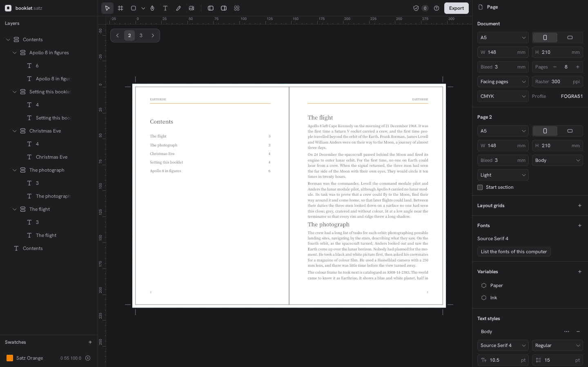

# Satz

Desktop publishing in the browser: posters and multi-page documents, print-ready PDF.

**[Open Satz](https://leonhardweiler.github.io/satz/)**



## Examples

`examples/poster.satz` (A2) and `examples/booklet.satz` (8 pages A5, master pages,
threaded text) are CMYK documents with a spot colour; open them with Ctrl+O. The
photograph is [Earthrise](https://images.nasa.gov/details/as08-14-2383) by
William Anders, NASA, in the public domain.

## Develop

```sh
nix develop
./check              # fmt, clippy, tests, wasm build, tsc, lint, build, canvas-vs-pdf e2e
pnpm -C web dev
SATZ_WRITE_EXAMPLES=1 cargo test examples   # writes examples/*.satz again
SATZ_WRITE_FIXTURES=1 cargo test fixture    # writes web/src/testdata again
```

`pnpm -C web test` needs the WASM build in `web/src/engine`, which `./check build` makes.
